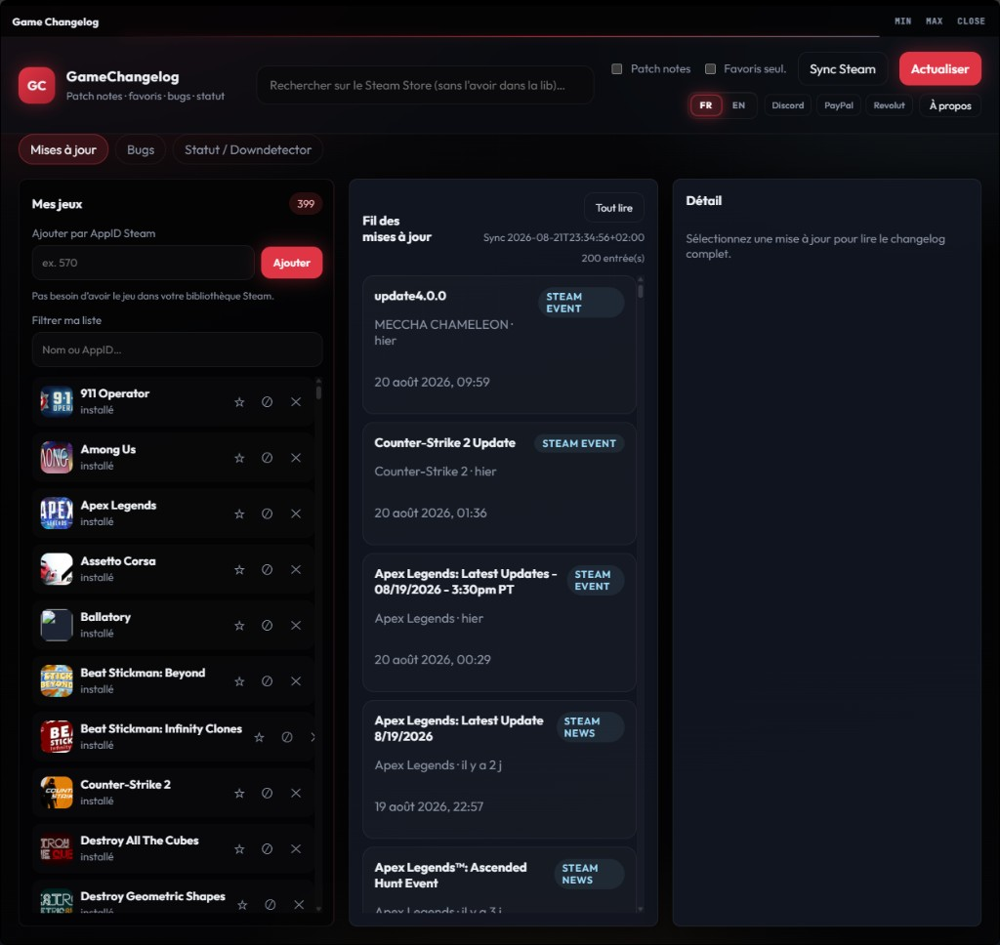

[Français](README.md) · [English](README.en.md)

# GameChangelog

Follow **Steam patch notes** for your games: update feed, favorites, bug notes, server status.  
**Free** · **no account** · **your lists stay on this PC**

## What it does

- Lists your games (local Steam library, or any game you add)
- Shows Steam updates (news + events)
- Filter by name / AppID, favorites, or **hidden** games (kept out of the feed)
- Local bug notes + Steam Discussions link
- Steam / Downdetector status if you think servers are down
- French | English

## On your PC

Extract `GameChangelog.zip`, run `GameChangelog.exe` (keep the folder together).

| What | Where |
|------|-------|
| The app | The folder you extracted the zip into |
| Games, cache, bugs | `%LOCALAPPDATA%\ChangeLog-Central\` |
| Language and update check | `%LOCALAPPDATA%\Mr-Aurevo-X\user-settings.json` *(shared with other Mr-Aurevo-X apps — don’t delete it if you still use them)* |

[Download](https://github.com/Mr-Aurevo-X/GameChangelog/releases) · **v1.0.3**

## First launch

1. Download the zip, extract, run `GameChangelog.exe`
2. If Steam is installed and you’ve signed in once: your games fill in, then names and patch notes
3. Otherwise: **Sync Steam**, or search a game at the top, or enter an AppID (e.g. `570`) — the game doesn’t need to be installed

Windows may show a warning: the binary is **not signed**. That is SmartScreen, not a “virus” verdict.

## App updates

In **About**, you can enable a GitHub version check (read-only). **Nothing downloads by itself.** You grab the zip from Releases if you want it.

## Official build only

**https://github.com/Mr-Aurevo-X/GameChangelog**

A fork or copy elsewhere is not my version. Software as-is, no warranty — see `LICENSE`, `PRIVACY.md` and `SECURITY.md`.

## Support (optional)

If you like the work, a coffee — otherwise just enjoy.

---

Dreamed by **Mr-Aurevo-X**. Cursor made the dream real.
