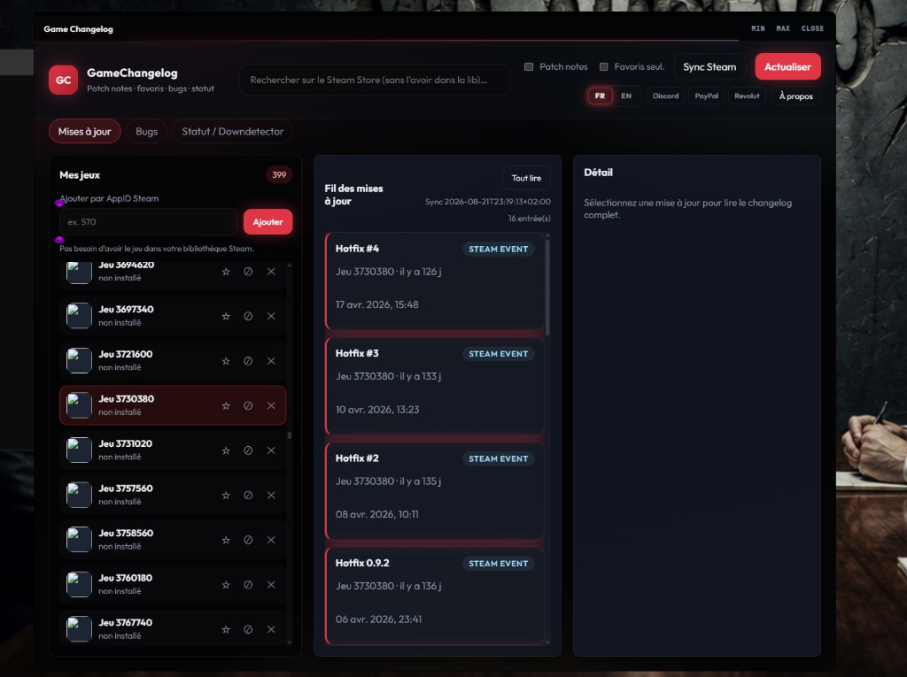

[Français](README.md) · [English](README.en.md)

# GameChangelog

Suis les **patch notes** de tes jeux Steam : fil d’actus, favoris, notes de bugs, statut des serveurs.  
**Gratuit** · **sans compte** · **tes listes restent sur ton PC**

## Ce que ça fait

- Liste tes jeux (bibliothèque Steam locale, ou un jeu que tu ajoutes)
- Affiche les mises à jour Steam (news + events)
- Filtre par nom / AppID, favoris, ou jeux **cachés** (plus dans le fil)
- Notes de bugs locales + lien Discussions Steam
- Statut Steam / Downdetector si tu penses que c’est down
- Français | English

## Sur ton PC

Extrais `GameChangelog.zip`, lance `GameChangelog.exe` (garde tout le dossier ensemble).

| Quoi | Où |
|------|-----|
| L’app | Le dossier où tu as extrait le zip |
| Tes jeux, cache, bugs | `%LOCALAPPDATA%\ChangeLog-Central\` |
| Langue et vérif. de version | `%LOCALAPPDATA%\Mr-Aurevo-X\user-settings.json` *(partagé avec d’autres apps Mr-Aurevo-X — ne l’efface pas si tu les utilises encore)* |

[Télécharger](https://github.com/Mr-Aurevo-X/GameChangelog/releases) · **v1.0.3**

## Premier lancement

1. Télécharge le zip, extrais, lance `GameChangelog.exe`
2. Si Steam est installé et déjà ouvert une fois : tes jeux se remplissent tout seuls, puis les noms et les patch notes
3. Sinon : **Sync Steam**, ou cherche un jeu en haut, ou entre un AppID (ex. `570`) — pas besoin que le jeu soit installé

Windows peut afficher un avertissement : le fichier n’est **pas signé**. C’est SmartScreen, pas un verdict « virus ».

## Mises à jour de l’app

Dans **À propos**, tu peux activer une vérif. de nouvelle version sur GitHub (lecture seule). **Rien ne se télécharge tout seul.** Tu prends le zip sur la page Releases si tu veux.

## Seule version que je cautionne

**https://github.com/Mr-Aurevo-X/GameChangelog**

Un fork ou une copie ailleurs n’est pas ma version. Logiciel tel quel, sans garantie — voir `LICENSE` et `PRIVACY.md`.

## Soutien (optionnel)

Si le boulot te plaît, un café — sinon profite.

---

Rêvée par **Mr-Aurevo-X**. Cursor a réalisé le rêve.
